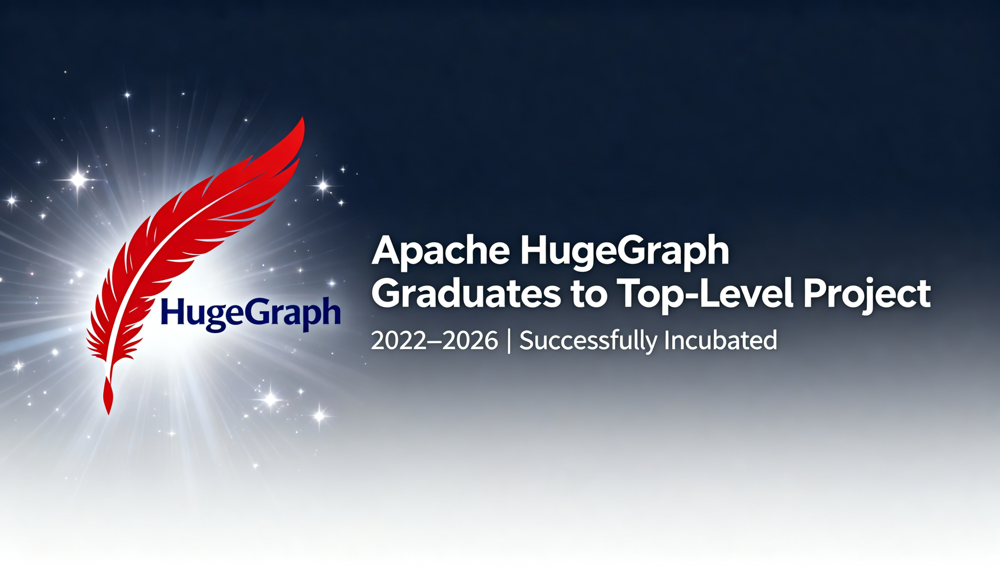
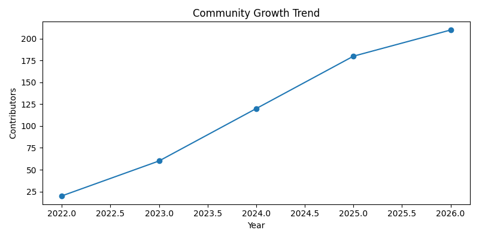
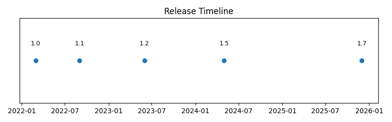
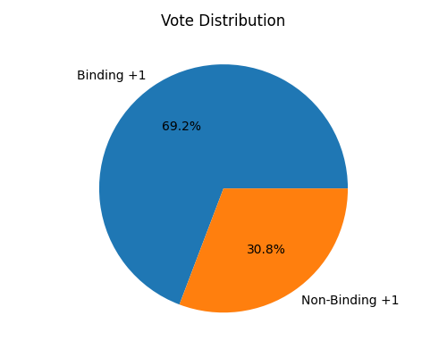

# Apache HugeGraph 成功毕业：从孵化器到顶级项目的四年征程

关键点是，开源世界又迎来一个重要的里程碑。经过四年的精心孵化，Apache HugeGraph 项目在2026年1月成功完成了从Apache孵化器毕业的投票，正式晋升为Apache顶级项目。这个消息对于图计算社区来说，无疑是一个值得庆祝的时刻。但是，这个过程并非一帆风顺，它凝聚了无数贡献者的智慧与汗水。问题在于，一个项目如何才能从孵化器脱颖而出？HugeGraph 用它的实践给出了答案。

## 项目简介：什么是 Apache HugeGraph？

Apache HugeGraph 是一个开源的高性能分布式图数据库。它专门设计用于处理大规模、复杂的关联数据。图数据库的核心思想是将数据表示为节点和边，节点代表实体，边代表实体之间的关系。这种模型非常适合社交网络分析、推荐系统、金融风控、知识图谱等场景。HugeGraph 提供了完整的图数据库功能，包括数据建模、存储、查询和分析。

具体来说，HugeGraph 支持多种图查询语言，例如 Gremlin，这使得用户能够执行复杂的图遍历操作。它具备高可扩展性，可以轻松应对百亿级顶点和边的存储与查询需求。项目采用插件化架构，允许用户根据需要扩展存储后端、计算引擎或集成其他工具。例如，用户可以选择使用 RocksDB、Cassandra 或 HBase 作为存储引擎。这种灵活性让 HugeGraph 能够适应不同的部署环境。

在实际应用中，HugeGraph 已经证明了其价值。金融公司用它来分析交易网络，识别潜在的欺诈行为。电商平台利用它构建商品推荐系统，通过用户行为图提升购物体验。电信运营商则依赖它进行网络拓扑管理和故障根因分析。这些例子展示了图数据库解决现实问题的能力。HugeGraph 的目标是降低图技术的使用门槛，让更多开发者能够利用图的力量。

## 孵化历程回顾：2022年1月至2026年1月

HugeGraph 的孵化之旅始于2022年1月，当时项目正式进入Apache孵化器。进入孵化器意味着项目需要遵循Apache软件基金会的治理模式，建立开放的社区，并确保所有贡献都符合Apache许可证。初始阶段，项目团队专注于代码库的迁移和清理。他们将原有的代码库迁移到Apache基础设施，并开始接受社区贡献。这个过程需要细致的工作，以确保知识产权清晰且符合Apache政策。

2022年至2023年期间，项目发布了多个Apache版本。第一个Apache版本 1.0.0 在2022年中期推出，标志着项目在Apache生态下的正式起步。随后，团队持续迭代，修复问题并添加新功能。社区开始逐渐壮大，吸引了来自不同背景的开发者。项目通过邮件列表、GitHub Issues 和 Pull Requests 进行协作，确保决策过程透明。孵化器导师提供了宝贵的指导，帮助项目团队理解Apache的“社区重于代码”理念。

2024年是项目发展的关键一年。HugeGraph 发布了 1.5.0 版本，引入了性能优化和新的管理工具。社区贡献者数量显著增长，从最初的几十人增加到超过一百人。项目参与了谷歌编程之夏和开源软件供应链点亮计划，这些活动吸引了学生和新人贡献者。同时，项目开始与更多生态系统项目集成，例如与 SeaTunnel 的数据集成能力增强。这些进展为毕业奠定了坚实基础。

2025年至2026年初，项目加速向毕业目标迈进。团队发布了 1.7.0 版本，进一步稳定了核心功能。社区治理结构得到完善，新增了提交者和项目管理委员会成员。生产环境中的应用案例不断增多，证明了项目的成熟度。最终，在2026年1月，项目发起了毕业投票。投票过程公开透明，所有讨论都在邮件列表中进行。经过社区评审，投票获得一致通过，HugeGraph 成功毕业为Apache顶级项目。

## 关键成就亮点

### 社区成长

社区是Apache项目的核心。HugeGraph 在孵化期间，社区规模实现了显著增长。贡献者总数超过210人，他们来自全球各地，包括中国、美国、欧洲等地。这些贡献者不仅提交代码，还参与文档编写、测试、问题解答和社区推广。项目新增了10位提交者，这些提交者拥有代码库的写入权限，负责评审和合并贡献。同时，项目管理委员会新增了2位成员，他们参与项目战略决策和日常管理。

社区活动也丰富多彩。项目定期举办线上会议，讨论技术路线和社区事务。通过参与谷歌编程之夏和开源软件供应链点亮计划，HugeGraph 吸引了多名学生贡献者，他们完成了图算法优化、文档改进等任务。社区还建立了用户论坛和微信群组，方便用户交流使用经验。这种活跃的社区氛围促进了知识共享和协作创新。社区成长的数据可以通过图表直观展示。

### 版本发布

版本发布是项目成熟度的重要指标。在孵化期间，HugeGraph 发布了5个Apache版本，版本号从 1.0.0 到 1.7.0。每个版本都经过严格的测试和评审，确保质量和稳定性。版本发布过程遵循Apache发布指南，包括投票、签名和分发。5位不同的发布经理主导了这些发布，体现了社区成员的广泛参与。发布内容涵盖性能提升、新功能添加和问题修复。

例如，1.2.0 版本改进了分布式事务支持，1.4.0 版本增强了图算法库，1.6.0 版本优化了查询性能。这些版本迭代反映了项目对用户需求的响应和技术演进。发布时间线展示了项目的持续进步。

### 生产应用

HugeGraph 已经在多个行业的生产环境中得到应用。金融领域，银行和保险公司使用它进行反欺诈分析。通过构建交易网络图，系统能够快速识别异常模式和关联风险。电商平台利用 HugeGraph 构建个性化推荐系统。基于用户行为图，算法可以推荐相关商品，提升销售转化率。电信行业应用 HugeGraph 进行网络管理和故障诊断。网络拓扑图帮助工程师可视化设备连接，快速定位问题根源。

这些应用案例证明了 HugeGraph 的可靠性和实用性。用户反馈表明，HugeGraph 在处理大规模图数据时表现出色，查询延迟低，系统稳定性高。生产应用不仅验证了技术，还推动了项目的持续改进。用户在实际使用中遇到的问题和需求，常常成为新功能开发的动力。例如，某个电商用户需要实时图更新能力，项目团队随后在版本中加入了相应优化。

### 生态系统

生态系统集成扩展了 HugeGraph 的能力边界。项目与 SeaTunnel 深度集成，SeaTunnel 是一个数据集成平台，支持多种数据源。通过集成，用户可以将数据从关系数据库、消息队列等系统轻松导入 HugeGraph。这简化了数据准备工作，让图分析更便捷。HugeGraph 还兼容 TinkerPop，TinkerPop 是图计算领域的标准框架。兼容性意味着用户可以使用熟悉的 Gremlin 查询语言操作 HugeGraph，降低了学习成本。

此外，项目参与了多个开源计划。在谷歌编程之夏中，学生贡献者开发了新的图可视化工具。在开源软件供应链点亮计划中，团队改进了代码依赖管理。这些合作丰富了项目功能，也加强了与更广泛开源社区的联系。生态系统建设不仅包括技术集成，还涉及文档、教程和案例分享。项目官网提供了详细的入门指南和API文档，帮助用户快速上手。社区成员撰写了多篇技术博客，分享使用经验和最佳实践。

### 治理合规

治理合规是Apache项目的基本要求。HugeGraph 在孵化期间，建立了完整的治理结构。项目管理委员会负责监督项目方向，确保遵循Apache政策。所有决策都在公开邮件列表中进行，避免私下讨论。代码贡献遵循贡献者许可协议，确保知识产权清晰。发布流程严格遵循Apache指南，包括投票和签名验证。项目还定期进行许可证检查，确保所有依赖项兼容Apache许可证。

治理合规不仅关乎法律问题，也影响社区健康。透明的治理吸引了更多贡献者，因为他们知道自己的贡献会受到公平对待。项目管理委员会成员经过社区选举产生，体现了民主原则。这种治理模式为项目的长期可持续发展提供了保障。例如，当有争议的技术决策出现时，社区通过公开讨论达成共识，避免了分裂风险。治理合规也体现在文档和沟通中。项目维护了清晰的贡献指南，说明如何提交代码或报告问题。邮件列表归档公开可查，方便新人了解历史讨论。

## 投票结果总结

毕业投票是项目孵化的最终检验。HugeGraph 的毕业投票于2026年1月进行，投票持续了72小时。投票在Apache孵化器邮件列表公开进行，所有社区成员均可参与。投票结果一致支持毕业，总投票数26票，通过率100%。其中，IPMC成员投出18票绑定支持票，这些票具有决定权。社区成员投出8票非绑定支持票，表达了对项目的认可。没有反对票或弃权票，这表明项目获得了广泛共识。

投票分布图表清晰展示了这一结果。

从投票邮件中，我们可以提取到许多正面评价。一位IPMC成员写道：> “HugeGraph 展示了成熟的社区和稳定的代码库，完全符合顶级项目的标准。” 另一位社区贡献者表示：> “项目在孵化期间进步显著，我很高兴看到它毕业。” 这些金句反映了社区对项目的信心。投票结果不仅是一个形式，更是对四年努力的肯定。它证明 HugeGraph 已经建立了健康的社区生态，具备了自我持续发展的能力。

投票过程也体现了Apache的协作文化。所有讨论都公开进行，投票人提供了详细的理由。例如，有投票人指出项目在文档和测试方面的改进。这种反馈帮助项目团队识别优势和改进空间。投票结果总结后，项目正式从孵化器毕业，成为Apache顶级项目。这意味着 HugeGraph 将拥有更大的自主权，同时继续遵循Apache的核心价值观。毕业不是终点，而是新的起点。项目需要继续维护社区活跃度，推动技术创新。投票结果的高通过率为未来奠定了良好基础。

## 相关资源

### 项目链接
- [Apache HugeGraph 官网](https://hugegraph.apache.org/) - 项目官方网站
- [GitHub 仓库](https://github.com/apache/hugegraph) - 源代码与发布版本
- [项目文档](https://hugegraph.apache.org/docs/) - 使用指南与 API 文档

### 投票与提案
- [毕业投票线程](https://lists.apache.org/thread/djkxttgpj08v74r8rqdv3np856g3krlr) - Apache 邮件列表投票讨论
- [董事会提案](https://agenda.apache.org/meetings/2026-01-21?#establish-the-apache-hugegraph-project) - 设立项目的特别提案

### 相关项目
- [Apache SeaTunnel](https://seatunnel.apache.org/) - 数据集成平台
- [Apache TinkerPop](https://tinkerpop.apache.org/) - 图计算框架

## 致谢与展望

致谢是毕业文章的重要部分。首先，感谢所有社区贡献者，你们的代码、文档、测试和反馈推动了项目前进。特别感谢孵化器导师，他们提供了宝贵的指导和建议。感谢Apache软件基金会，提供了开放协作的平台和支持。感谢用户和合作伙伴，你们的信任和应用案例验证了项目价值。感谢项目管理委员会和提交者，你们的辛勤工作维护了项目质量。感谢参与投票的每一位成员，你们的支持让毕业成为现实。

展望未来，HugeGraph 作为Apache顶级项目，将继续致力于图计算技术的推广和创新。短期计划包括发布新版本，增强实时图处理能力。项目将优化分布式架构，支持更大规模的数据集。社区方面，计划举办更多线上和线下活动，吸引新贡献者。教育推广也是重点，项目将开发更多教程和案例，帮助开发者掌握图技术。长期愿景是构建更完善的图生态系统，与其他Apache项目深度集成。

项目还将关注新兴技术趋势。例如，探索图神经网络与图数据库的结合，以支持更复杂的分析任务。加强云原生支持，让HugeGraph 更容易部署在云环境中。国际化也是方向之一，项目将改进多语言文档，服务全球用户。治理方面，继续保持开放透明，鼓励社区参与决策。通过这些努力，HugeGraph 旨在成为图计算领域的领导者，推动数据关联价值的挖掘。

毕业是一个里程碑，但旅程还在继续。社区的力量将驱动HugeGraph 走向更远的未来。我们邀请所有感兴趣的人加入，无论是贡献代码、分享经验，还是提出建议。共同建设一个更强大的图计算生态，让数据连接创造更多可能。Apache HugeGraph 的故事，才刚刚开始。

## 引用金句

> 1. **Justin Mclean** - +1 (binding) — Justin Mclean
> 2. **Gordon** - +1 (binding) — Gordon
> 3. **Paul King** - +1 (binding) — Paul King
> 4. **Willem Jiang** (ningjiang) - +1 (binding) — Willem Jiang
> 5. **Calvin Kirs** (kirs) - +1 (binding) — Calvin Kirs
> 6. **Nicholas Jiang** - +1 (binding) — Nicholas Jiang
> 7. **Xiangdong Huang** - +1 (binding) — Xiangdong Huang
> 8. **Jerry Tan** - +1 (binding) — Jerry Tan
> 9. **Furkan Kamaci** - +1 (binding) — Furkan Kamaci
> 10. **Lidong Dai** (David) - +1 (binding) — Lidong Dai
> 11. **Yu Li** - +1 (binding) — Yu Li
> 12. **PJ Fanning** (fanningpj) - +1 (binding) — PJ Fanning
> 13. **Juan Pan** - +1 (binding) — Juan Pan
> 14. **tison** - +1 (binding) — tison
> 15. **Ed Espino** - +1 (binding) — Ed Espino
> 16. **William Guo Wei** - +1 (binding) — William Guo Wei
> 17. **li gang** (李岗) - +1 (binding) — li gang
> 18. **Jean-Baptiste Onofré** (jbonofre) - +1 (binding) — Jean-Baptiste Onofré
